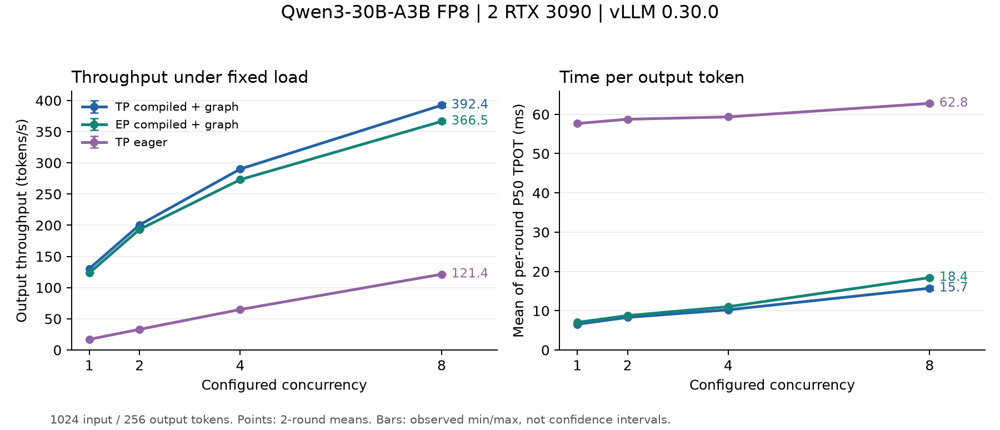

# Qwen3 MoE on 2 RTX 3090

用同机双 RTX 3090 研究 Qwen3 MoE 的部署、并行策略和性能瓶颈，并把整机问题缩小到可单卡验证的 Marlin 算子。

**当前状态：**完成部署、TP / EP / eager 对照、阶段 profiling 和 W13 默认配置测量。候选优化尚未验证，未提交性能优化 PR。本仓库记录实验和判断依据。

实验日期为 2026-10-03，仓库整理于 2026-10-04。模型为 Qwen 官方 `Qwen3-30B-A3B-Instruct-2507-FP8`；这里没有上游认证的双 3090 性能合格线。

## 从哪里开始

| 你想做什么 | 阅读入口 |
|---|---|
| 看懂我们为什么这样做实验 | [工程案例](docs/case-study.md) |
| 核对性能、正确性和结论边界 | [完整实验报告](docs/experiment-report.md) |
| 从 Python 追到 MoE 与通信入口 | [代码链路与练习](docs/code-walkthrough.md) |
| 先在 CPU 复算，再考虑租卡 | [复现指南](docs/reproduce.md) |
| 继续做单算子优化 | [下一步计划](docs/next-steps.md) |

## 关键结果

固定 1024 输入 / 256 输出、并发 8，使用 vLLM 官方 benchmark。下表为两轮指标的算术均值；延迟列为两轮各自 P50 的均值。

| 配置 | 输出吞吐 tok/s | TTFT ms | TPOT ms |
|---|---:|---:|---:|
| TP=2 默认编译与 CUDA graph | 392.36 | 1201.07 | 15.73 |
| Attention TP=2，专家 EP=2 | 366.46 | 818.68 | 18.42 |
| TP=2 eager | 121.43 | 581.25 | 62.78 |

输出吞吐为测试总输出 token / 总时长。这里包含 prefill 与排队影响，不能直接与其他负载的纯 decode 数字比较。eager 同时改变编译和 CUDA graph，也不能单独归因。



- **纯 decode 热点：**C=8 的 rank0 trace 中，MoE Marlin 约占 kernel 耗时总和的 40%，NCCL AllReduce 约占 26%。整个 trace 的通信占比约 64%，两者的阶段和分母不同。
- **单卡测量起点：**W13 形状 M=8、N=768、K=2048、128 专家、top-k=8；默认配置中位延迟 88.05 μs。相对 FP32 反量化参照的 L2 误差约 0.228%。输入与路由为合成数据。
- **正确性限制：**自动任务检查全部通过；32-token greedy 检查 TP / eager 为 19/20 用例稳定，EP 为 18/20。开放题人工检查尚无记录，未完成完整精度或生产验收。
- **请求完成情况：**31 个 benchmark JSON 共 800 次成功请求、0 次失败；随机输出没有全部经过语义检查。

完整矩阵和逐轮数据见 [性能汇总](data/processed/2026-10-03/bench-main-summary.csv)与[原始逐轮指标](data/processed/2026-10-03/bench-per-round.csv)。

## 实验条件

| 项目 | 实际环境 |
|---|---|
| GPU | 2 × RTX 3090 24 GiB，同机，sm86 |
| 卡间路径 | CUDA P2P 双向检测 False；NCCL 日志为 SHM 路径 |
| 软件 | vLLM 0.30.0，PyTorch 2.13.0+cu130，Transformers 5.18.0，NCCL 2.29.7 |
| 模型 revision | `5a5a776300a41aaa681dd7ff0106608ef2bc90db` |
| 实际量化计算路径 | FP8 权重压缩、BF16 激活，Marlin weight-only |
| 调度参数 | 上下文 8192，max-num-seqs=8，batched tokens=2048，显存比例 0.85 |
| 缓存与通信 | chunked prefill 开，prefix caching 关；正式对照均禁用 custom AllReduce |

## 不租 GPU 也能复算

克隆仓库后，用 Python 3.11 或更新版本执行：

```bash
python analysis/summarize_snapshot.py
```

脚本只使用标准库，重新读取归档的 JSON 与 gzip trace，生成性能 CSV、正确性汇总和纯 decode 分组。运行成功说明数据与分析链路可复算，不代表重新完成 GPU 验证。

## 仓库结构

```text
docs/                     工程案例 报告 代码笔记 复现与续接
scripts/                  本轮实机最后使用的实验脚本
workloads/                固定检查用例和准备好的输入
analysis/                 不需要 GPU 的离线分析
data/raw/2026-10-03/       原始测量 命令 日志 trace 与哈希
data/processed/2026-10-03/ 汇总 CSV 和 JSON
third_party/vllm-0.30.0/   实机 Python 源码快照和上游许可证
env.sh                    模型 revision 与服务环境变量
```

`data/raw` 中的 README 和脚本是原始快照；复现入口使用根目录的 `scripts/` 和本仓库文档。模型权重、虚拟环境、HF 缓存和云实例登录信息不属于仓库。

## 贡献方向与学习目标

下一步从单卡 W13 默认 launch 选择开始，讨论一个候选，做同输入 A→B→A，再覆盖形状、路由和整模型。收益、数值、回退与上游目标 commit 都需要验证。[具体计划](docs/next-steps.md)

脚本设计、数据分析和文档整理包含 AI 辅助内容；学习练习与待验证项明确列在文档中。阅读源码快照时保留 vLLM 的版权与 Apache-2.0 许可声明，见 [来源说明](third_party/README.md)。
